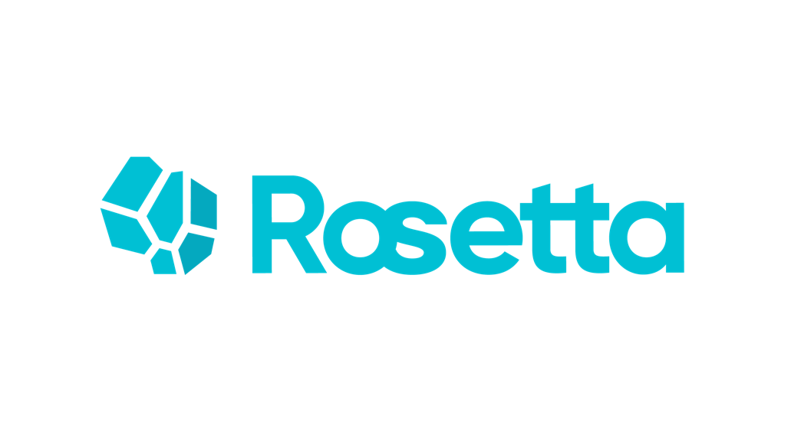

1.1 Logo from wechat link:

  - 1.2 Logo from the same file locally 
  
  - 1.3 The same Logo link with html mark
    

 
2.1 Logo from processon link:
  
  - 2.2 Logo from the same file locally
  
  - 2.3 The same Logo link with html mark
    

    
3.1 Logo from LatticeX forum link:
  
  - 3.2 Logo from the same file locally
  
  - 3.3 The same Logo link with html mark
     

